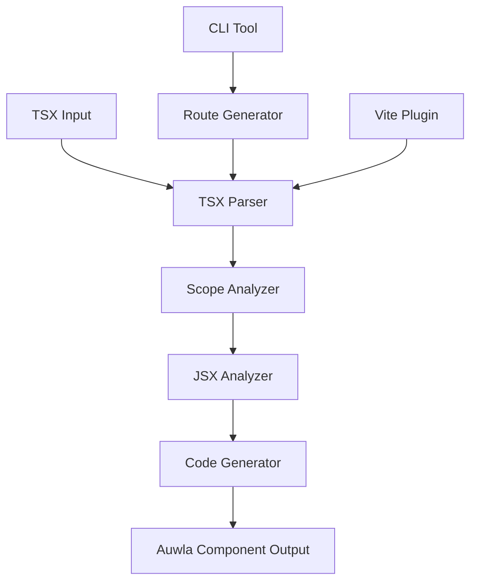

# Design Document

## Overview

This design outlines a rewrite of the Auwla compiler to focus exclusively on TSX compilation with clean architecture, correct scoping, and maintainable code organization. The new compiler will have three main phases: parsing, analysis, and code generation, with clear separation of concerns.

## Architecture

### High-Level Architecture



### Core Components

1. **TSX Parser**: Parses TSX files and extracts metadata, imports, and component structure
2. **Scope Analyzer**: Determines correct scoping for variables and functions based on @page directive
3. **JSX Analyzer**: Analyzes JSX structure and converts to intermediate representation
4. **Code Generator**: Generates clean Auwla component code from analyzed structure
5. **Route Generator**: Scans for TSX pages and generates route files
6. **Vite Plugin**: Integrates with Vite for development workflow

## Components and Interfaces

### 1. TSX Parser (`tsx-parser.ts`)

```typescript
interface TSXFile {
  metadata: PageMetadata
  imports: ImportDeclaration[]
  components: ComponentDeclaration[]
  topLevelCode: CodeBlock[]
}

interface PageMetadata {
  isPage: boolean
  route?: string
  title?: string
  description?: string
  guard?: string
}

interface ComponentDeclaration {
  name: string
  isDefault: boolean
  isExported: boolean
  params: Parameter[]
  body: CodeBlock[]
  jsxReturn: JSXElement
}

interface CodeBlock {
  type: 'variable' | 'function' | 'expression'
  code: string
  dependencies: string[]
  scope: 'top-level' | 'component-body'
}
```

### 2. Scope Analyzer (`scope-analyzer.ts`)

```typescript
interface ScopedFile {
  metadata: PageMetadata
  imports: ImportDeclaration[]
  componentScope: CodeBlock[]  // Goes inside page function
  uiScope: CodeBlock[]        // Goes inside Component callback
  mainComponent: ComponentDeclaration
}

class ScopeAnalyzer {
  analyze(tsxFile: TSXFile): ScopedFile
  private determineScope(block: CodeBlock, isPageFile: boolean): 'component' | 'ui'
  private resolveDependencies(blocks: CodeBlock[]): CodeBlock[]
}
```

### 3. JSX Analyzer (`jsx-analyzer.ts`)

```typescript
interface JSXStructure {
  elements: UIElement[]
  conditionals: ConditionalBlock[]
  loops: LoopBlock[]
  expressions: ReactiveExpression[]
}

interface UIElement {
  tag: string
  props: ElementProp[]
  children: UIElement[]
  events: EventHandler[]
}

interface ReactiveExpression {
  expression: string
  dependencies: string[]
  type: 'text' | 'attribute' | 'condition'
}
```

### 4. Code Generator (`code-generator.ts`)

```typescript
class CodeGenerator {
  generate(scopedFile: ScopedFile): string
  private generateImports(imports: ImportDeclaration[]): string
  private generatePageFunction(component: ComponentDeclaration, componentScope: CodeBlock[]): string
  private generateComponentCallback(uiScope: CodeBlock[], jsx: JSXStructure): string
  private generateUIElements(elements: UIElement[]): string
}
```

## Data Models

### File Processing Flow

```typescript
// Input: TSX file content
const tsxContent = `
//@page/example
import { ref } from "auwla"

const count = ref(0)  // Top-level -> Component scope

export default function ExamplePage() {
  const message = "hello"  // Component body -> UI scope
  
  return <div>{count.value} - {message}</div>
}
`

// Step 1: Parse TSX
const tsxFile: TSXFile = parseTSX(tsxContent)

// Step 2: Analyze scoping
const scopedFile: ScopedFile = analyzeScope(tsxFile)

// Step 3: Analyze JSX
const jsxStructure: JSXStructure = analyzeJSX(scopedFile.mainComponent.jsxReturn)

// Step 4: Generate code
const output: string = generateCode(scopedFile, jsxStructure)
```

### Scoping Rules Implementation

```typescript
class ScopeAnalyzer {
  private determineScope(block: CodeBlock, isPageFile: boolean): 'component' | 'ui' {
    if (!isPageFile) {
      // Regular component: everything stays in original scope
      return block.scope === 'top-level' ? 'component' : 'ui'
    }
    
    // Page file: invert the scoping
    if (block.scope === 'top-level') {
      // Outside export default -> inside page function (component scope)
      return 'component'
    } else {
      // Inside export default -> inside Component callback (ui scope)
      return 'ui'
    }
  }
}
```

## Error Handling

### Compilation Errors

```typescript
class CompilationError extends Error {
  constructor(
    message: string,
    public file: string,
    public line?: number,
    public column?: number
  ) {
    super(message)
  }
}

// Error types
- ParseError: Invalid TSX syntax
- ScopeError: Variable reference issues
- JSXError: Invalid JSX structure
- GenerationError: Code generation failures
```

### Error Recovery

1. **Parse Errors**: Provide clear syntax error messages with line numbers
2. **Scope Errors**: Suggest variable placement corrections
3. **JSX Errors**: Highlight problematic JSX patterns
4. **Generation Errors**: Fall back to basic component structure

## Testing Strategy

### Unit Tests

```typescript
// Parser tests
describe('TSX Parser', () => {
  test('parses page metadata correctly')
  test('extracts component structure')
  test('identifies top-level vs component-body code')
})

// Scope analyzer tests
describe('Scope Analyzer', () => {
  test('applies correct scoping for page files')
  test('maintains original scoping for regular components')
  test('resolves variable dependencies')
})

// Code generator tests
describe('Code Generator', () => {
  test('generates clean imports')
  test('produces valid TypeScript')
  test('handles reactive expressions correctly')
})
```

### Integration Tests

```typescript
// End-to-end compilation tests
describe('TSX Compilation', () => {
  test('compiles simple page component')
  test('compiles component with complex scoping')
  test('handles conditional rendering')
  test('processes event handlers correctly')
})
```

### Test Files Structure

```
tests/
├── fixtures/
│   ├── simple-page.tsx
│   ├── complex-scoping.tsx
│   └── conditional-rendering.tsx
├── unit/
│   ├── parser.test.ts
│   ├── scope-analyzer.test.ts
│   └── code-generator.test.ts
└── integration/
    └── compilation.test.ts
```

## Implementation Plan

### Phase 1: Core Architecture
1. Create new TSX parser with clean interfaces
2. Implement scope analyzer with correct scoping rules
3. Build basic code generator for simple cases

### Phase 2: JSX Processing
1. Enhance JSX analyzer for complex patterns
2. Add support for conditional rendering and loops
3. Implement reactive expression handling

### Phase 3: Integration
1. Update route generator to use new compiler
2. Modify Vite plugin for new architecture
3. Add comprehensive error handling

### Phase 4: Migration
1. Remove legacy .auwla support
2. Clean up old compiler code
3. Update documentation and examples

## File Organization

```
src/
├── core/
│   ├── tsx-parser.ts
│   ├── scope-analyzer.ts
│   ├── jsx-analyzer.ts
│   └── code-generator.ts
├── utils/
│   ├── ast-utils.ts
│   ├── scope-utils.ts
│   └── formatting.ts
├── integrations/
│   ├── route-generator.ts
│   ├── vite-plugin.ts
│   └── cli.ts
├── types/
│   ├── ast.ts
│   ├── scoping.ts
│   └── jsx.ts
└── index.ts
```

This design provides a clean, maintainable architecture focused exclusively on TSX compilation with correct scoping and high-quality code generation.